# 电商数据仓库（GMall Data Warehouse）

> Lambda 架构的电商大数据数仓系统：离线批量（Hive on Spark）+ 实时流式（Flink）双链路，覆盖数据采集 → 数仓建模 → 任务调度 → 可视化大屏全流程。

[](https://hive.apache.org/)
[](https://flink.apache.org/)
[](https://doris.apache.org/)
[](https://spark.apache.org/)
[](https://hbase.apache.org/)
[](https://dolphinscheduler.apache.org/)
[](LICENSE)

## 项目概述

基于 3 节点 CentOS 7 虚拟机集群，构建电商平台（GMall）Lambda 架构数据仓库。

- **离线链路**：数据经 Flume + Maxwell + Kafka 采集至 HDFS，Hive on Spark 完成 ODS → DIM → DWD → DWS → ADS 五层建模，Doris OLAP 加速，DolphinScheduler 调度，Superset 输出 16 张业务报表。
- **实时链路**：复用采集通道，Kafka 作为实时 ODS 层，Flink 流式处理构建 DIM（HBase 维度存储）、DWD（业务过程拆分）、DWS（窗口聚合写 Doris），ADS 通过 SpringBoot 数据服务 + Sugar 大屏实时监控。

## 离线技术架构

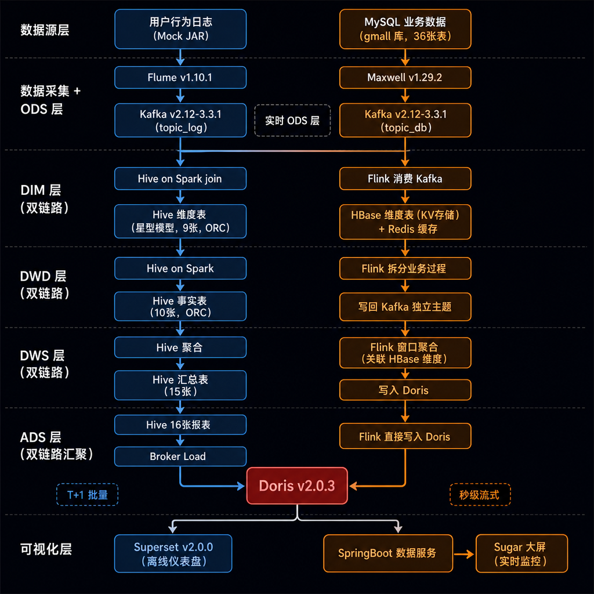

## 项目截图

| 集群进程（jps） | Hive ODS 层查询 |
|:---:|:---:|
| 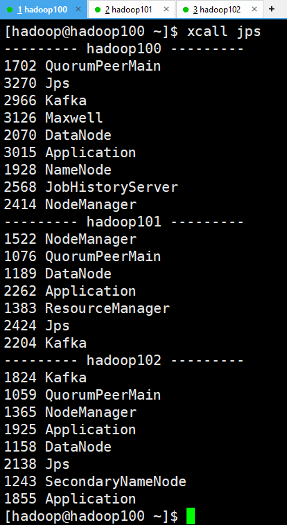 | 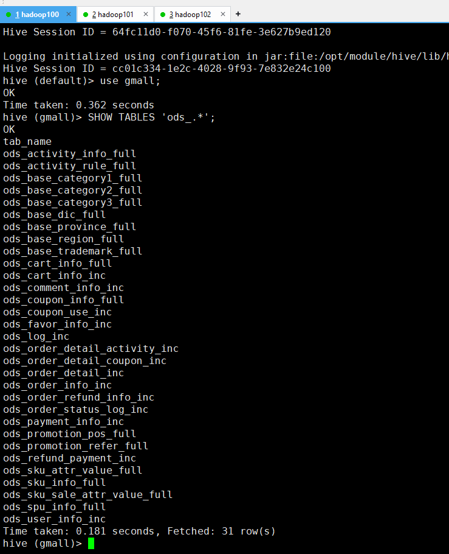 |


| Hive DIM 层查询 | Hive DWD 层查询 |
|:---:|:---:|
| 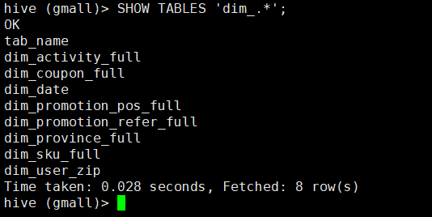 | 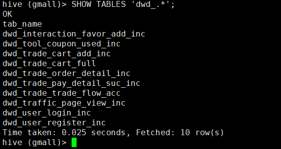 |

| Hive DWS 层查询 | Hive ADS 层查询 |
|:---:|:---:|
| 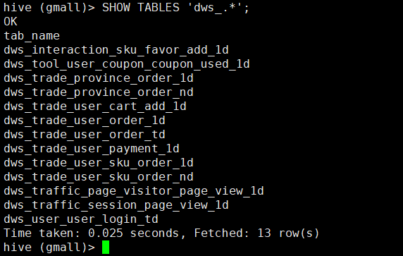 | 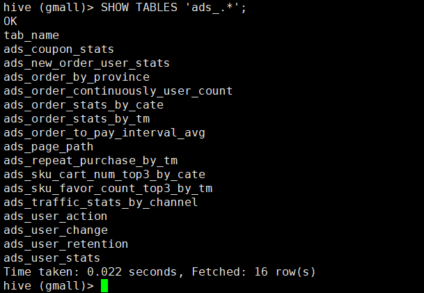 |

| Doris 查询结果 | HDFS NameNode |
|:---:|:---:|
| 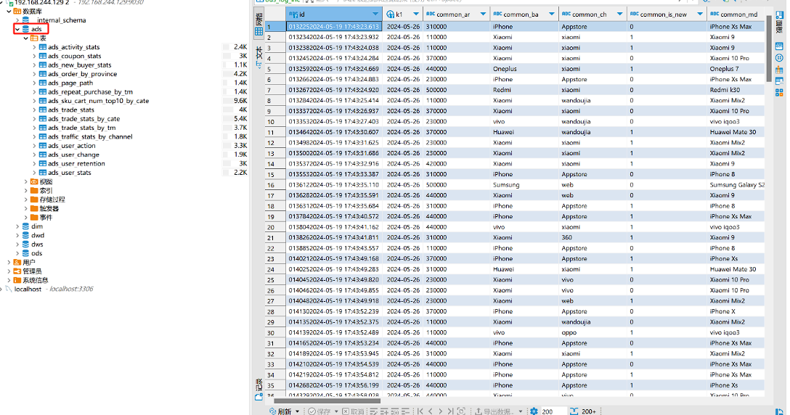 | 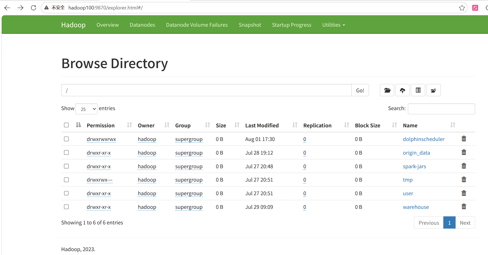 |

| DolphinScheduler 工作流 | Superset 仪表盘 |
|:---:|:---:|
| 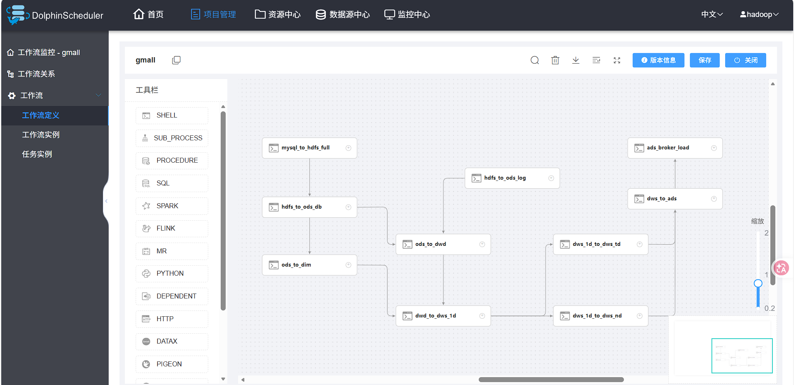 | 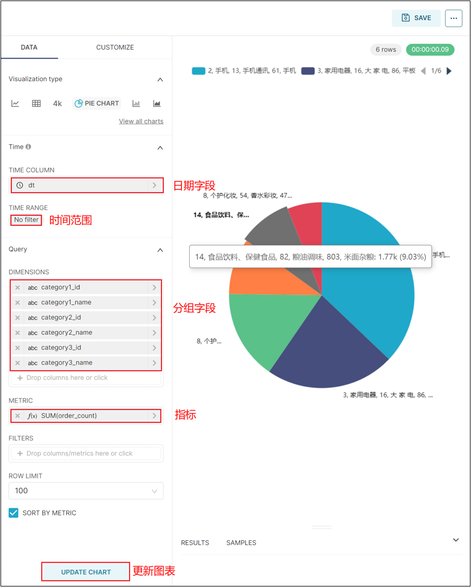 |

## 技术栈

| 类别 | 组件 | 版本 |
|------|------|------|
| 数据采集 | Flume, Maxwell | 1.10.1 / 1.29.2 |
| 消息队列 | Kafka | 2.12-3.3.1 |
| 数据同步 | DataX | 202309 |
| 分布式存储 | Hadoop HDFS | 3.3.6 |
| 离线计算引擎 | Spark (Hive on Spark) | 3.3.1 |
| 数据仓库 | Hive | 3.1.3 |
| 流计算引擎 | Flink | 1.17.1 |
| KV 数据库 | HBase | 2.4.11 |
| 缓存 | Redis | 6.0.8 |
| 协调服务 | Zookeeper | 3.7.1 |
| 关系数据库 | MySQL | 8.0.39 |
| OLAP 引擎 | Apache Doris | 2.0.3 |
| 任务调度 | DolphinScheduler | 2.0.5 |
| 数据可视化 | Apache Superset | 2.0.0 |
| 实时大屏 | Sugar | - |
| 代码托管 | GitLab CE | 16.2.1 |
| 数据服务 | SpringBoot (gmall2026-publisher) | - |

## 集群规划

| 服务 | hadoop100 (4GB) | hadoop101 (4GB) | hadoop102 (8GB) |
|------|:---:|:---:|:---:|
| NameNode / RM / SNN | NN | RM | SNN |
| Hive / Spark / DataX | ✓ | | |
| Flume 采集 | ✓ | ✓ | |
| Flume 消费 | | | f2 + f3 |
| Maxwell CDC | ✓ | | |
| MySQL 元数据库 | ✓ | | |
| Doris FE + BE | | | ✓ |
| DolphinScheduler | | | ✓ (Standalone) |
| Superset | | ✓ | |
| Flink | ✓ (JM+TM) | ✓ (TM) | ✓ (TM) |
| HBase | ✓ (Master+RS) | ✓ (RS) | ✓ (RS) |
| Redis | ✓ | | |
| GitLab | | | ✓ |

## 数仓分层

### 离线分层

```
ADS  (应用层) — 16张报表，面向 Doris/Superset
DWS  (汇总层) — 15张汇总表，1日/7日/30日/历史至今
DWD  (明细层) — 10张事实表，事务型/周期快照/累积快照
DIM  (维度层) — 9张维度表，星型模型，含拉链表
ODS  (贴源层) — 30张表，1:1 映射源数据
```

### 实时分层

```
ADS  (应用层) — SpringBoot 数据服务 + Sugar 大屏
DWS  (汇总层) — Flink 窗口聚合 → Doris 聚合表（动态分区）
DWD  (明细层) — Flink 拆分业务过程 → Kafka 独立主题
DIM  (维度层) — 维度实时同步 → HBase（幂等覆盖写入）
ODS  (贴源层) — Kafka 原始主题（topic_log / topic_db）
```

## 目录结构

```
gmall-data-warehouse/
├── 电商数据仓库V6.0_项目介绍.md            # 项目总览（架构/分层/技术栈）
├── 集群启停速查手册.md                      # 全部组件启停命令
├── README.md
│
├── doc/                                    # 从0-1共十一阶段实施文档
│   ├── 阶段一_服务器基础环境准备.md
│   ├── 阶段二_Hadoop+ZK+Kafka+Flume日志采集通道.md
│   ├── 阶段三_MySQL+Maxwell业务数据采集通道.md
│   ├── 阶段四_数据同步策略+Hive_on_Spark环境.md
│   ├── 阶段五_数据模拟+数仓分层建模_ODS层.md
│   ├── 阶段六_Doris数据迁移.md
│   ├── 阶段七_DolphinScheduler工作流调度.md
│   ├── 阶段八_Superset可视化.md
│   ├── 阶段九_实时架构前置环境搭建.md       # IDEA/GitLab/Flink/HBase/Redis
│   ├── 阶段十_实时数仓建设.md              # 实时 ODS/DIM/DWD/DWS
│   └── 阶段十一_ADS层与数据可视化.md        # SpringBoot 数据服务 + Sugar 大屏
│
├── gmall2026-realtime/                     # 实时数仓 IDEA 工程源码（Flink）
│   ├── realtime-common/                    # 公共模块（基类/实体/常量/函数/工具）
│   ├── realtime-dim/                       # DIM 层（维度同步到 HBase）
│   ├── realtime-dwd/                       # DWD 层（9个业务过程子模块）
│   ├── realtime-dws/                       # DWS 层（7个窗口聚合子模块）
│   └── gmall2026-publisher/                # SpringBoot 数据服务（Doris REST 接口）
│
├── scripts/                                # 集群运维脚本
│   ├── cluster.sh                          # 集群整体启停
│   ├── zk.sh / kf.sh / hdp.sh             # Zookeeper / Kafka / Hadoop 启停
│   ├── f1.sh / f2.sh / f3.sh              # Flume 启停
│   ├── mxw.sh                              # Maxwell 启停
│   ├── lg.sh                               # 模拟数据生成
│   ├── superset.sh                         # Superset 启停
│   ├── xsync                               # 集群文件分发
│   └── xcall                               # 集群批量命令
│
├── DS_scripts/                            # DolphinScheduler 每日调度脚本
│   ├── mysql_to_hdfs_full.sh               # DataX 全量同步
│   ├── hdfs_to_ods_log.sh                  # ODS 日志表
│   ├── hdfs_to_ods_db.sh                   # ODS 业务表
│   ├── ods_to_dim.sh                       # DIM 层每日
│   ├── ods_to_dwd.sh                       # DWD 层每日（7表）
│   ├── dwd_to_dws_1d.sh                    # DWS 1日汇总（9表）
│   ├── dws_1d_to_dws_nd.sh                 # n日汇总（2表）
│   ├── dws_1d_to_dws_td.sh                 # 历史至今每日（2表）
│   ├── dws_to_ads.sh                       # ADS 层（16表）
│   └── ads_broker_load.sh                  # ADS → Doris
│
├── sql/
│   ├── gmall.sql                           # MySQL 业务库建表脚本（36表）
│   ├── ods.sql / dim.sql / dwd.sql         # Hive DDL（ODS/DIM/DWD层）
│   ├── dws.sql / ads.sql                   # Hive DDL（DWS/ADS层）
│   ├── table_process_dim维度初始配置.sql    # 实时 DIM 维度配置表初始化
│   ├── table_process_dwd事实初始配置.sql    # 实时 DWD 事实配置表初始化
│   └── date_info.txt                       # 日期维度表数据（2026-2027）
│
├── images/                                 # 架构图 + 项目截图（11张）
│
├── datax-config-generator/                 # DataX 配置文件生成器（Java + Maven）
│   ├── pom.xml
│   └── src/main/java/com/datax/
│       ├── Main.java                       
│       ├── beans/Column.java, Table.java   
│       ├── configuration/Configuration.java
│       └── helper/DataxJsonHelper.java, MysqlHelper.java
│
└── 模拟数据脚本/
    ├── gmall-remake-mock-2023-05-15-3.jar  # 日志/业务数据模拟器
    ├── application.yml                     # Mock 配置（日期/用户/业务）
    ├── logback.xml                         
    └── path.json                           
```

## 快速开始

### 1. 启动集群
```bash
ssh hadoop100 "zk.sh start && start-dfs.sh"
ssh hadoop101 "start-yarn.sh"
ssh hadoop100 "kf.sh start"
```

### 2. 启动数据采集
```bash
ssh hadoop100 "f1.sh start"          # Flume 日志采集 (hadoop100)
ssh hadoop102 "f2.sh start"          # Flume 日志消费 → HDFS
ssh hadoop100 "mxw.sh start"         # Maxwell CDC
ssh hadoop102 "f3.sh start"          # Flume 业务消费 → HDFS
```

### 3. 执行每日数仓任务
```bash
# DolphinScheduler 编排或手动串行执行：
mysql_to_hdfs_full.sh all 2026-06-19
hdfs_to_ods_log.sh 2026-06-19
hdfs_to_ods_db.sh all 2026-06-19
ods_to_dim.sh all 2026-06-19
ods_to_dwd.sh all 2026-06-19
dwd_to_dws_1d.sh all 2026-06-19
dws_1d_to_dws_nd.sh all 2026-06-19
dws_1d_to_dws_td.sh all 2026-06-19
dws_to_ads.sh all 2026-06-19
ads_broker_load.sh 2026-06-19
```

### 4. Web 控制台
| 组件 | 地址 | 账号/密码 |
|------|------|-----------|
| HDFS NameNode | http://hadoop100:9870 | — |
| YARN RM | http://hadoop101:8088 | — |
| Flink UI | http://hadoop100:8081 | — |
| HBase | http://hadoop100:16010 | — |
| DolphinScheduler | http://hadoop102:12345/dolphinscheduler | admin / dolphinscheduler123 |
| Doris FE | http://hadoop102:8030 | root / root |
| Superset | http://hadoop101:8787 | admin / admin123 |
| GitLab | http://hadoop102 | root / 初始密码 |

### 5. 实时链路启动（阶段九~十一）

```bash
# 1. 启动实时采集（复用离线通道）
ssh hadoop100 "lg.sh"                  # 生成实时数据（mock.if-realtime=1）
ssh hadoop100 "f1.sh start"            # Flume 日志采集
ssh hadoop100 "mxw.sh start"           # Maxwell 业务采集

# 2. 启动实时组件
ssh hadoop100 "/opt/module/flink/bin/start-cluster.sh"   # Flink 集群
ssh hadoop100 "/opt/module/hbase/bin/start-hbase.sh"     # HBase 集群
ssh hadoop100 "redis-server ~/my_redis.conf"             # Redis

# 3. 提交 Flink 实时任务（按层依次提交）
#    DIM → DWD → DWS 各模块 jar 包
flink run -c com.flink.gmall.realtime.dim.app.DimApp \
    realtime-dim-1.0-SNAPSHOT.jar

# 4. 启动数据服务 + 大屏
cd gmall2026-realtime/gmall2026-publisher
mvn spring-boot:run                   # SpringBoot 数据服务
# Sugar 大屏对接 http://hadoop102:8080 数据接口
```

## 关键指标

| 指标 | 数值 |
|------|------|
| 数据表总数 | 36 (MySQL) + 30 (ODS) + 9 (DIM) + 10 (DWD) + 15 (DWS) + 16 (ADS) = 116 |
| ADS 报表 | 16 张，覆盖流量/用户/商品/交易/优惠券五大主题 |
| 离线每日脚本 | 10 个，Hive SQL 自动切 MR 引擎 |
| 离线 DAG 工作流 | 7 步串行，DolphinScheduler Standalone 编排 |
| 实时 Flink 模块 | realtime-dim + realtime-dwd(9) + realtime-dws(7) |
| 实时维度存储 | HBase 2.4.11，维度表与业务表 1:1 映射 |
| 实时大屏 | Sugar 对接 SpringBoot 数据服务 |
| 集群规模 | 3 节点 CentOS 7.9，8GB + 4GB + 4GB |

## License

MIT
